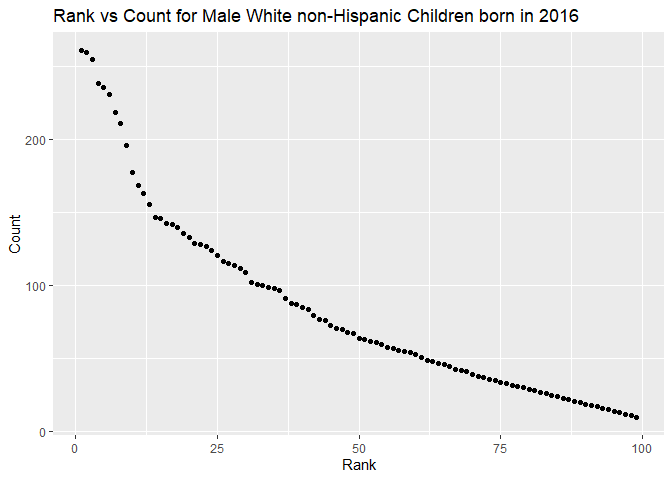

Homework 2
================
Julia Thompson
10/1/2019

## Problem 1

Read and cleaned Mr. Trash Wheel data.

``` r
trash_data = read_excel(
  path = "./data/Trash-Wheel-Collection-Totals-8-6-19.xlsx",
  sheet = "Mr. Trash Wheel",
  range = "A2:N408") %>%
  janitor::clean_names() %>%
  drop_na(dumpster) %>%
  mutate(sports_balls = as.integer(sports_balls))
```

Read and cleaned precipitation data for 2017 and 2018. Rows without
precipitation data were omitted and a variable was added for *year*.

``` r
precip_2017 = read_excel(
  path = "./data/Trash-Wheel-Collection-Totals-8-6-19.xlsx",
  sheet = "2017 Precipitation",
  skip = 1) %>% 
  janitor::clean_names() %>% 
  drop_na(month) %>% 
  mutate(year = 2017)

precip_2018 = read_excel(
  path = "./data/Trash-Wheel-Collection-Totals-8-6-19.xlsx",
  sheet = "2018 Precipitation",
  skip = 1) %>% 
  janitor::clean_names() %>% 
  drop_na(month) %>% 
  mutate(year = 2018)
```

Combined precipitation datasets and converted month to a character
variable.

``` r
precip_data = 
  bind_rows(precip_2017, precip_2018) %>% 
  mutate(
    month = month.name[month]
  )
```

The first dataset created was *trash\_data*, which is made up of 344
observations and 14 variables. It contains a variable *dumpster*, which
ranges from 1 to 344 and denotes the dumpster ID. For each dumpster, we
have variables *month*, *year*, and *date* to inform us about when the
data was collected. Additionally, there are several variables that
correspond to specifics about what each dumpster collected (such as
*plastic\_bottles* and *chip\_bags*). The median number of sports balls
collected in a dumpster in 2017 was 8.

The second dataset created was *precip\_data*, made up of 24
observations and 3 variables. The variables are *month*, *total*, and
*year*, which give the month of the year (January through December),
total inches of rainfall, and year (2017 or 2018) respectively. The
total precipitation in 2018 was 70.33 inches, which is a large increase
compared to the total precipitation in 2017 of 32.93 inches.

## Problem 2

Cleaned the data in *pols-month.csv* and split the variable *mon* into
integer variables year, month, and day. Replaced month number with month
name and created a president variable taking values *gop* and *dem*, and
removed *prez\_dem*, *prez\_gop*, and *day* variables.

Note: a few values in *prez\_gop* had a value of 2 instead of 1. Recoded
those to be 1 for our purposes, but I would check with the investigator
regarding how this should be handled.

``` r
pols_data = read_csv(
  file = "./data/pols-month.csv") %>% 
  separate(col = mon, into = c("year", "month", "day"), sep = "-", convert = TRUE) %>% 
  mutate(
    prez_gop = ceiling(prez_gop/2),
    month = month.name[month],
    president = prez_gop - prez_dem,
    president = recode(president, `-1` = "dem", `1` = "gop")
  ) %>% 
  select(year, month, president, everything(), -day, -prez_gop, -prez_dem)
```

    ## Parsed with column specification:
    ## cols(
    ##   mon = col_date(format = ""),
    ##   prez_gop = col_double(),
    ##   gov_gop = col_double(),
    ##   sen_gop = col_double(),
    ##   rep_gop = col_double(),
    ##   prez_dem = col_double(),
    ##   gov_dem = col_double(),
    ##   sen_dem = col_double(),
    ##   rep_dem = col_double()
    ## )

Cleaned the data in *snp.csv* using a similar process to the above,
deleted the *day* variable, and reordered the data so that *year* and
*month* are the leading columns.

``` r
snp_data = read_csv(
  file = "./data/snp.csv") %>% 
  separate(col = date, into = c("month", "day", "year"), sep = "/", convert = TRUE) %>% 
  mutate(
    month = month.name[month]
  ) %>% 
  select(year, month, everything(), -day)
```

    ## Parsed with column specification:
    ## cols(
    ##   date = col_character(),
    ##   close = col_double()
    ## )

Tidied the *unemployment* data, ensuring that it could be merged with
the above datasets using *year* and *month* as keys.

``` r
unemp_data = read_csv(
  file = "./data/unemployment.csv") %>% 
  janitor::clean_names() %>% 
  rename(`1` = jan, `2` = feb, `3` = mar, `4` = apr, `5` = may, `6` = jun, `7` = jul, `8` = aug, `9` = sep,           `10` = oct, `11` = nov, `12` = dec) %>% 
  pivot_longer(
    cols = `1`:`12`,
    names_to = "month",
    values_to = "unemp_pct"
  ) %>% 
  mutate(
    month = as.integer(month),
    month = month.name[month]
  )
```

    ## Parsed with column specification:
    ## cols(
    ##   Year = col_double(),
    ##   Jan = col_double(),
    ##   Feb = col_double(),
    ##   Mar = col_double(),
    ##   Apr = col_double(),
    ##   May = col_double(),
    ##   Jun = col_double(),
    ##   Jul = col_double(),
    ##   Aug = col_double(),
    ##   Sep = col_double(),
    ##   Oct = col_double(),
    ##   Nov = col_double(),
    ##   Dec = col_double()
    ## )

Joined the datasets by merging *snp* into *pols*, and merging
*unemployment* into the result.

``` r
snp_pols = 
  left_join(pols_data, snp_data, by = c("year","month"))

snp_pols_unemp = 
  left_join(snp_pols, unemp_data, by = c("year", "month"))
```

The *pols\_data* dataset has 9 variables and 822 observations. It
contains data on the political party in power in various branches of
government from 1947 to 2015. Examples of this are *gov\_gop*, which
contains the number of republican governors, and *sen\_dem*, the number
of democratic senators on a given date.

The *snp\_data* dataset contains information on the S\&P stock index
from 1950 to 2015, and has 3 variables and 787 observations. The
variables are *year*, *month*, and *close*, which notes the closing
values of the S\&P index on the given date.

The *unemp\_data* dataset has 3 variables and 816 observations. The
variables include *year*, *month*, and *unemp\_pct* from 1948 to 2015.
*Unemp\_pct* gives the percentage of unemployment for each given date,
and ranges from 2.5 to 10.8.

## Problem 3

``` r
baby_data = read_csv(
  file = "./data/Popular_Baby_Names.csv") %>% 
    janitor::clean_names() %>% 
  mutate(
    childs_first_name = str_to_sentence(childs_first_name),
    ethnicity = recode(ethnicity, "WHITE NON HISP" = "WHITE NON HISPANIC",
                                    "ASIAN AND PACI" = "ASIAN AND PACIFIC ISLANDER",
                                    "BLACK NON HISP" = "BLACK NON HISPANIC")
  ) %>% 
  distinct()
```

    ## Parsed with column specification:
    ## cols(
    ##   `Year of Birth` = col_double(),
    ##   Gender = col_character(),
    ##   Ethnicity = col_character(),
    ##   `Child's First Name` = col_character(),
    ##   Count = col_double(),
    ##   Rank = col_double()
    ## )

Created a table showing the rank in popularity of the name “Olivia” as a
female baby name over time.

``` r
# we want rows to be ethnicities and columns to be years that hold rank

pop_olivia = filter(baby_data, childs_first_name == "Olivia" & gender == "FEMALE") %>% 
  pivot_wider(
    id_cols = c("year_of_birth", "ethnicity", "rank"),
    names_from = "year_of_birth",
    values_from = "rank"
  )

knitr::kable(pop_olivia)
```

| ethnicity                  | 2016 | 2015 | 2014 | 2013 | 2012 | 2011 |
| :------------------------- | ---: | ---: | ---: | ---: | ---: | ---: |
| ASIAN AND PACIFIC ISLANDER |    1 |    1 |    1 |    3 |    3 |    4 |
| BLACK NON HISPANIC         |    8 |    4 |    8 |    6 |    8 |   10 |
| HISPANIC                   |   13 |   16 |   16 |   22 |   22 |   18 |
| WHITE NON HISPANIC         |    1 |    1 |    1 |    1 |    4 |    2 |

Created a table showing the most popular name among male children over
time.

``` r
pop_male = filter(baby_data, rank == "1" & gender == "MALE") %>% 
  pivot_wider(
    id_cols = c("year_of_birth", "ethnicity", "childs_first_name"),
    names_from = "year_of_birth",
    values_from = "childs_first_name"
  )

knitr::kable(pop_male)
```

| ethnicity                  | 2016   | 2015   | 2014   | 2013   | 2012   | 2011    |
| :------------------------- | :----- | :----- | :----- | :----- | :----- | :------ |
| ASIAN AND PACIFIC ISLANDER | Ethan  | Jayden | Jayden | Jayden | Ryan   | Ethan   |
| BLACK NON HISPANIC         | Noah   | Noah   | Ethan  | Ethan  | Jayden | Jayden  |
| HISPANIC                   | Liam   | Liam   | Liam   | Jayden | Jayden | Jayden  |
| WHITE NON HISPANIC         | Joseph | David  | Joseph | David  | Joseph | Michael |

Created a scatterplot of number of children with a name against rank in
popularity of that name among male, white non-hispanic children born in
2016.

``` r
#count vs rank for male white non hispanic children in 2016
white_male_2016 = filter(baby_data, gender == "MALE" & year_of_birth == "2016" & ethnicity == "WHITE NON HISPANIC") 

ggplot(white_male_2016, aes(x=rank, y=count)) + 
  geom_point() +
  labs(
    title = "Rank vs Count for Male White non-Hispanic Children born in 2016",
    x = "Rank",
    y = "Count"
  )
```

<!-- -->
